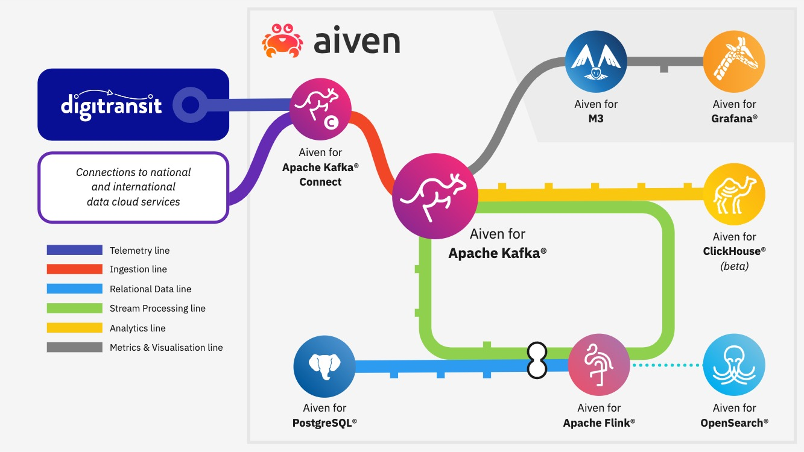

# Big Data LDN Digitransit demo



## Instructions

1. Create `env.sh` containing your Aiven API token

```
cat > env.sh <<EOF
export TF_VAR_aiven_api_token=<your api key>
EOF
```

2. Create infrastructure

> **Note:** Update `terraform.tfvars` with your Aiven project name first.

```
$ source env.sh
$ terraform init
$ terraform plan
$ terraform apply
```

3. Create Python 3 virtualenv and install dependencies

```
$ python3 -m venv venv
$ source venv/bin/activate
$ pip install -r requirements.txt
```

4. Load reference data into PostgreSQL (requires `psql` to be installed)

```
$ avn service cli bigdataldn-demo-postgres
defaultdb=> \i scripts/create_postgres_schema.sql; 
```

5. Update ClickHouse integration

```
$ avn project switch <your-project-name>
$ bash scripts/create_clickhouse_kafka_integration.sh
```

6. Create ClickHouse materialized view using SQL in `scripts/create_clickhouse_view.sql`

